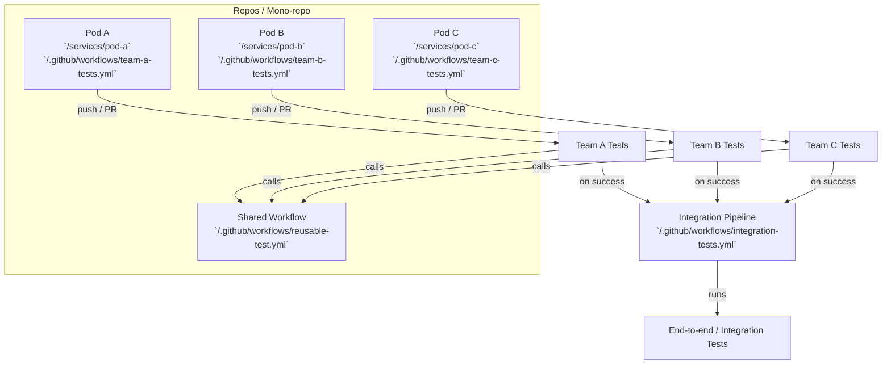

# CI Architecture Diagram

Below is a high-level architecture diagram showing per-pod workflows, a shared reusable workflow, and an integration pipeline.

Notes
- Each pod/team owns its own workflow file under their service folder (example: `services/pod-a/.github/workflows/team-a-tests.yml` or root-level `/.github/workflows/team-a-tests.yml`).
- Teams can call a central `reusable-test.yml` using `workflow_call` to standardize setup, caching and artifact handling.
- `integration-tests.yml` uses `workflow_run` triggers to run only after team workflows complete successfully.
- Prefer separate workflow files per team for autonomy; use a central reusable workflow for shared steps.

Quick links (create or edit these files in your repo):
- [/.github/workflows/reusable-test.yml](.github/workflows/reusable-test.yml)
- [/.github/workflows/team-a-tests.yml](.github/workflows/team-a-tests.yml)
- [/.github/workflows/integration-tests.yml](.github/workflows/integration-tests.yml)

---

Next steps: generate example workflow files for each pod and a reusable workflow template (I can create these in the repo if you want).